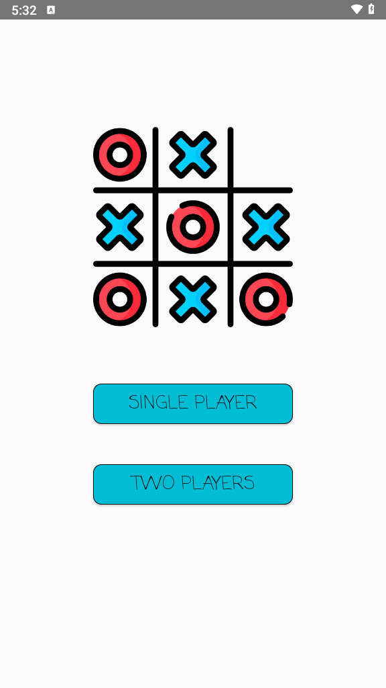
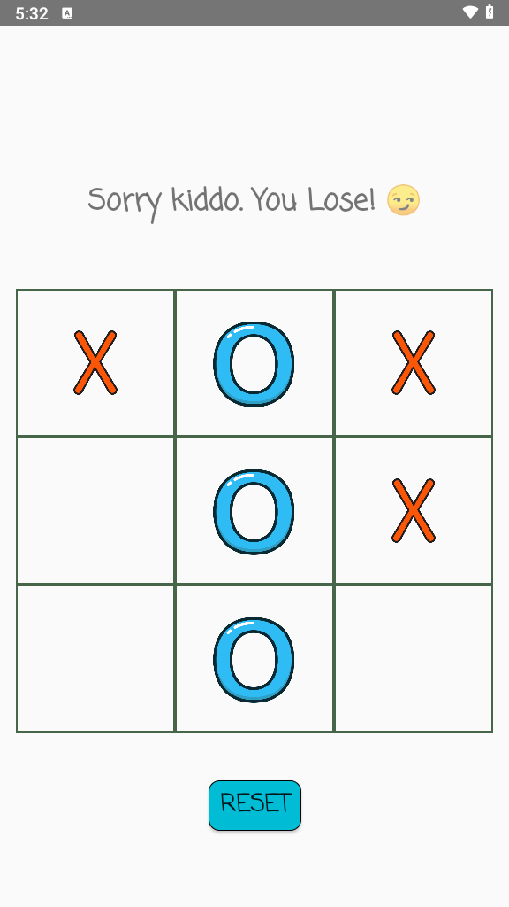
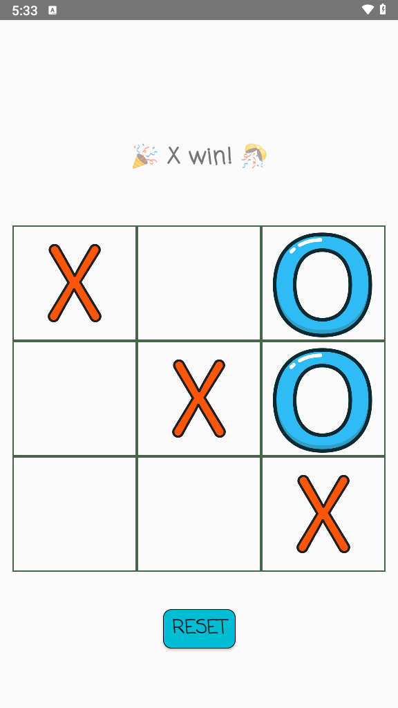

# Tic Tac Toe Android App

This is a simple **Tic Tac Toe** game built for Android using **Java** in **Android Studio**. The game includes both **Single-player** (play against the computer) and **Two-player** (play against a friend on the same device) modes.

## Features

- **Two-player mode**: Play against a friend on the same device.
- **Single-player mode**: Play against the computer, with the computer making decisions using the **Minimax algorithm**.
- **Reset Option**: Restart the game at any time.

## Screenshots


### single player:

### two players:


## Installation

1. Clone the repository to your local machine:
   ```bash
   git clone https://github.com/your-username/ticktactoe-android.git
